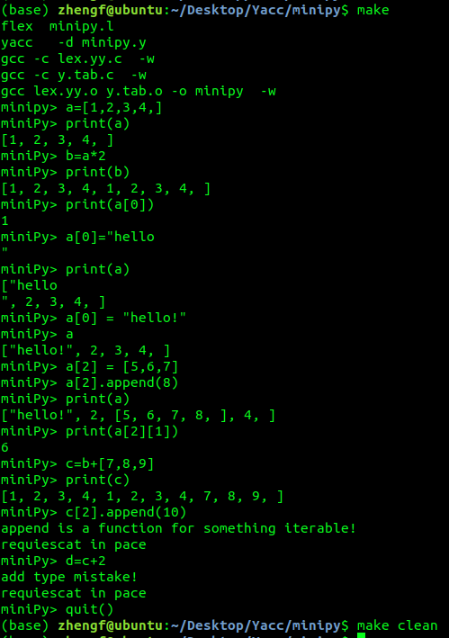

# 2019课程实验——minipy
### 小组成员 刘云飞(PB17051044)、邵飞然()、张越群()

### 进度
11.22 minipy1.0 可以莽穿测试集

### 使用方式
下载到本地后进入`minipy`文件夹，输入`make`指令即可。

### 已实现功能
1. Python中四种基本类型(Int, Real, String, List)
2. 良定义的四则运算，包括字符串和列表的加法和乘法
3. 列表的嵌套、多维列表、按索引取值、切片等
4. 对绝大部分可赋值对象的赋值操作
5. 针对列表等对象的部分函数（range，len, print, append)
6. ....
